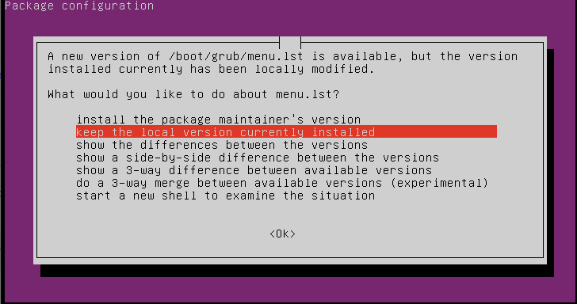

# Day 0 - Creating Your Own Server - with a $5 Digital Ocean plan

* [Previous "Day 0" threads](https://www.reddit.com/r/linuxupskillchallenge/search/?q=Day%200&restrict_sr=1)

## INTRO

First, you need a server. You can't really learn about administering a remote Linux server without having one of your own - so today we're going to buy one!

Through the magic of Linux and virtualization, it's now possible to get a small Internet server setup almost instantly - and at very low cost. Technically, what you'll be doing is creating and renting a VPS  ("Virtual Private Server"). In a datacentre somewhere, a single physical server running Linux will be split into a dozen or more Virtual servers, using the KVM (Kernel-based Virtual Machine) feature that's been part of Linux since early 2007.

In addition to a hosting provider, we also need to choose which "flavour" of Linux to install on our server. If you're new to Linux then the range of "distributions" available can be confusing - but the latest LTS ("Long Term Support") version of Ubuntu Server is a popular choice, and what you'll need for this course.

These instructions will walk you through using Digital Ocean (<http://digitalocean.com>) as your VPS hosting provider. They are rated highly, with a very simple and slick interface - and low cost of $5 (USD) per month for the minimal server that you'll be creating. (Of course, if you have a strong reason to use another provider, then by all means do so, but be sure to choose Ubuntu Server 20.04)

The Digital Ocean sign-up process fails to work with uBlock enabled because Digital Ocean uses services known to be associated with spam and aggressive marketing. You can work around this using Chrome Incognito mode for the registration, but a company using these services is likely to use aggressive marketing themselves.

## Signing up with Digital Ocean

There may be a free trial available. Search around for a code to use when signing up to get your systems for free.

### Phase one: Credit Card + Address

The registration process requires a credit card and your physical address.

### Phase two: Deploy an Ubuntu Server

On the screen after startup, there's an option to deploy an Ubuntu server:


#### Ubuntu 18.04 available

There does not seem to be any way to choose Ubuntu 20.04 at this point, so we'll use 18.04.


#### Use the $5 droplet plan


#### Choose a nearby data center

It probably auto-chose one that was appropriate.

#### Generate a very very very strong password for root

Generate it and write it down in 1Password or your own password management app. This is the only thing currently beweeen a system for which you are responsible and the massive hordes of attackers on the Internet. You'll fix that later, but right now, make this very strong.


Finally, choose "Create Droplet" to build your very own Linux server!

Don't panic if not much happens. After a minute or so the screen refreshes back to a fuller view of your cloud environment:


#### Change that awful name

There's no indication that this works, but it does. Click on the name of your system and then on the big name near the top of the next page:


Click on the name, type in the name you want and it'll rename the host at the Digital Ocean level:


## Logging in for the first time

Select your droplet and "Access" from the left-hand sidebar. Choose "Launch Recovery Console" and a new window should pop up with a remote (VNC) connection to your host's virtual screen


Copy your password and be ready to paste.

Enter "root" for the login.

Right click in the console area and use Chrome's "Paste as plain text" to enter your nasty passsword. Alternatively, you can type it, but if you picked a good one, that is going to be annoying.

Once logged in you should see something like this:


## Creating a working admin account

We want to follow the Best Practice of not logging as "root" remotely, so we'll create an ordinary user account, but one with the power to "become root" as necessary, like this:

```bash
adduser sbonds_adm
```

(Replace 'sbonds' with an appropriate username you will remember. The `_adm` indicates that this account can become root but this is simply a convention and not required by Linux.)

Create another hard-to-guess password. You won't be using it that often. Use the same "Paste as plain text" method as before.

Enter the user's full name (or an alias of your choosing) at the prompt. The room number, phone number, etc. can be left blank.


### Add user to local groups

Add this user to some local groups that grant extra privileges:

```bash
usermod --append --groups adm sbonds_adm
usermod --append --groups sudo sbonds_adm
```

*This* will be the account that you use to login and work with your server. It has been added to the 'adm' and 'sudo' groups, which on an Ubuntu system gives it access to read various logs and to "become root" as required via the _sudo_ command.

All done!


## You are now a sysadmin

### Log out as root and log in as your new user

Logout as *root*, by typing logout or *exit*, or, for the extremely lazy, `<ctrl>-d`, then login as your new sysadmin user.

### Apply recent updates

Upgrade the operating system and software to the latest release using these two commands:

`sudo apt update`

(you'll be asked to confirm your password)

Then:

`sudo apt upgrade`

If you see this screen, use `<tab>` to move to OK and keep the local version. Presumably Digital Ocean did this on purpose.



You may get this same prompt twice. Answer the same "keep the local" each time.

Don't worry too much about the output and messages from these commands, but it should be clear whether they succeeded or not. These commands are how you force the installation of updates on an Ubuntu Linux system, and only an administrator can do them. By upgrading we also minimize the chances of malicious attackers on the Internet actually gaining access. We're responsible for this server!

## We can now safely disable login as the *root* user

With our new working user able to perform all sysadmin tasks, there is no reason for us to login user *root*. Our server is exposed to all the internet, and we can expect continuous attempts to login from malicious bots - most of which will be attempting to login as *root*. While we did set a very secure password just before, it would be nice to know that remote login as *root* is actually *impossible* - and it's possible to do that with this command:

`sudo usermod --password "!" root`

This disables direct login access by setting the encoded password to the can-never-work value of `!`, while still allowing approved logged in users to "become root' as necessary - and is the normal default configuration of an Ubuntu system. (Digital Ocean's choice to enable "root" in their image is non-standard).

To logout, type _logout_ or _exit_ or `<ctrl>-d`.

Your server is now all set up and ready for the course!

## Remote access via SSH

You should see an "IPv4" entry for your server, this is its unique Internet IP address, and is how you'll connect to it via SSH (the Secure Shell protocol) - something we'll be covering in the first lesson.

Note that:

* This server is now running, and completely exposed to the whole of the Internet
* You alone are responsible for managing it
* You have just installed the latest updates, so it should be secure for now
